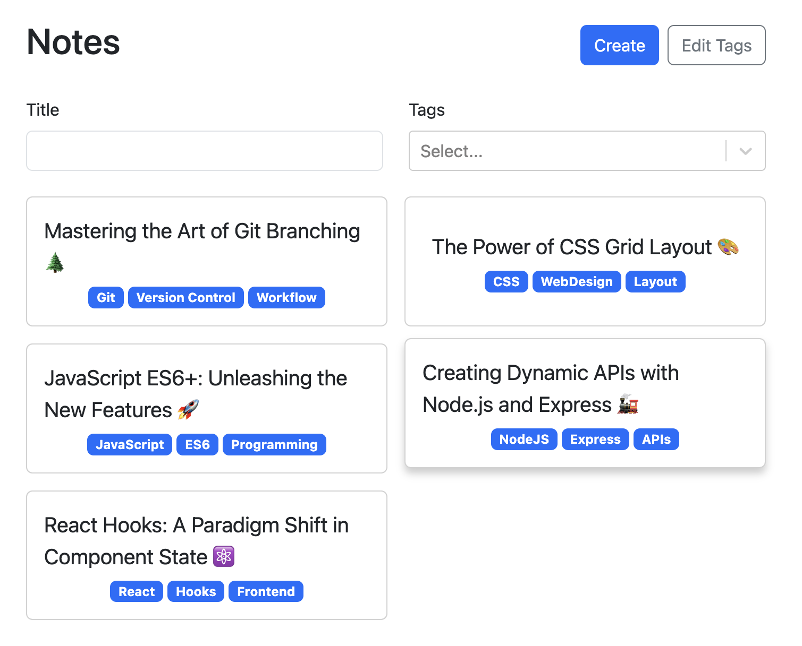

# React TypeScript Note-Taking App

A straightforward and feature-rich note-taking application built with React and TypeScript. This app allows users to seamlessly create, edit, and delete notes. The key features include the ability to filter notes by name and tags, ensuring a smooth organization of your thoughts and ideas.

## Features

- **Create, Edit, and Delete Notes:**
  - Effortlessly create new notes with a user-friendly interface.
  - Edit existing notes to refine your thoughts.
  - Delete notes when they are no longer needed.

- **Filtering by Name and Tags:**
  - Easily search and filter notes by name for quick access.
  - Organize notes using tags, making it convenient to categorize and find related content.

- **Editing Tags:**
  - Dynamically edit and manage tags associated with each note.
  - Enhance organization by updating tags as your content evolves.

## Additional Tools and Libraries

- **Vite:**
  - Lightning-fast build tool for React and TypeScript projects.

- **React Router DOM:**
  - Declarative navigation and routing for a seamless single-page application experience.

- **React Markdown:**
  - Render Markdown content within your notes for enhanced formatting.

- **UUID for Unique ID Generation:**
  - Utilize UUID (Universally Unique Identifier) for generating unique IDs for each note.

- **React-Select.Creatable:**
  - Enhance the user experience with a customizable select input for managing tags.

- **React Bootstrap and Bootstrap:**
  - Leverage the power of Bootstrap for a clean and responsive user interface.

  ## Demo and Preview

  

- **Demo Link:** [DEMO](https://demo-notes-app.netlify.app/)
